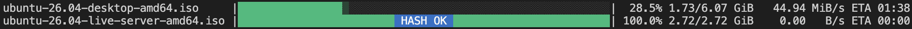

# mrdl



_"Mirror Downloader"_ - A resilient, concurrent, multi-mirror downloader written in Python.

`mrdl` is designed to download large files as quickly and reliably as possible by pulling segments from multiple mirrors simultaneously. It handles network hiccups, slow mirrors, rate-limiting, and checksum verification.

## Features

- **Multi-Mirror Concurrency**: Download distinct chunks of a single file from multiple mirrors concurrently. (See [example_single.py](examples/example_single.py))
- **Resilient Resume Support**: Saves download state in a `<filename>.progress` file. If interrupted, the download can be resumed exactly where it left off. Automatically detects if the remote file has changed and restarts if necessary. (See [example_pause_resume.py](examples/example_pause_resume.py))
- **Dynamic Speed Banning**: Automatically detects and temporarily bans mirrors that fall below a minimum speed threshold.
- **Rate Limit Handlers**: Respects HTTP `429 Too Many Requests` responses and honors the `Retry-After` header.
- **Global & Per-Thread Throttling**: Configure maximum download speeds globally or per thread using a Token Bucket algorithm. (See [example_shared_throttle.py](examples/example_shared_throttle.py) and [example_live_updates.py](examples/example_live_updates.py))
- **Stacked progress bars (`MultiProgress`)**: Renders multiple stacked progress bars for parallel downloads using block symbols and ANSI colors. (See [example_multi_progress.py](examples/example_multi_progress.py))
- **Extensible Component Architecture**: Separates writing, hashing, state persistence, progress reporting, and throttling into PEP 544 Protocols for injecting custom behavior.
- **Parallel Hash Verification**: Background thread hashing that supports any algorithm in Python's `hashlib` (e.g. MD5, SHA-256, SHA-512, etc.), supporting both computing-only (`algo`) and computing-and-verifying (`algo:expected_hex`) in real-time as chunks are successfully written to disk.

## Installation

`mrdl` isn't currently available via pip. You must install `mrdl` and its dependencies in your environment:

```bash
# Clone the repository
git clone https://github.com/marioferrari/mrdl.git
cd mrdl

# Install the package in editable mode
pip install -e .
```

## Command Line Interface (CLI)

Once installed, the `mrdl` command is available via CLI.

### Usage

```bash
mrdl <mirror_url_1> [<mirror_url_2> ...] -o <output_filename> [options]
```

### Options

| Option | Description | Default |
|:---|:---|:---|
| `-o`, `--output` | **(Required)** Local output filename/path to save the downloaded file. | N/A |
| `-t`, `--threads-per-mirror` | Number of concurrent download threads per mirror. | `1` |
| `--chunk-size` | Chunk segment size in bytes. | `67108864` (64MB) |
| `--min-speed` | Minimum download speed per mirror thread in KB/s. Slow mirrors are throttled/banned. | `1024` (1MB/s) |
| `--grace-period` | Speed grace period in seconds before applying minimum speed check. | `10` |
| `--checksum` | Hash algorithm for integrity verification. Use `algo` to compute and print (e.g., `sha256`) or `algo:expected_hex` to verify (e.g., `sha256:abc123...`). Supports any algorithm in Python's `hashlib` (md5, sha256, sha512, sha3_256, blake2b, ...). | None |
| `--max-speed` | Global download speed cap in KB/s across all threads combined. | None (Uncapped) |
| `--max-speed-per-thread` | Per-thread download speed cap in KB/s. | None (Uncapped) |
| `-s`, `--silent` | Run in silent mode. Suppresses all progress output and warnings (useful for daemon/CI environments). | False |
| `--use-mmap` | Use memory-mapped file writing. **Warning:** Known to cause silent page corruption on macOS APFS. | False |

### CLI Example

```bash
# Download a file using multiple mirrors with a 5 MB/s global speed cap and SHA-256 verification
mrdl \
  https://speed.hetzner.de/100MB.bin \
  http://ipv4.download.thinkbroadband.com/100MB.zip \
  -o download.bin \
  -t 2 \
  --max-speed 5120 \
  --checksum sha256:CC844CAC4B2310321D0FD1F9945520E2C08A95CEFD6B828D78CDF306B4990B3A
```

---

## Programmatic API Usage

You can import and use the `Downloader` class directly in your Python applications.

### Configuration and Result Models

`mrdl` configuration and outputs are structured using type-hinted dataclasses:

#### `DownloadConfig`
```python
@dataclass
class DownloadConfig:
    urls: Sequence[str] | str
    filename: str
    label: str | None = None
    threads_per_mirror: int = 1
    chunk_size: int = 64 * 1024 * 1024  # 64 MiB
    min_speed_kbps: float = 1024.0
    speed_grace_period: float = 10.0
    checksum: str | None = None
    max_speed_kbps: int | None = None
    max_speed_per_thread_kbps: int | None = None
    overwrite: bool = False
    silent: bool = False
    safe_state_saves: bool = False  # fsync the progress file on every save (useful on NFS/SMB)
    compact: bool = False
```

#### `DownloadResult`
```python
@dataclass(frozen=True)
class DownloadResult:
    status: DownloadState
    path: str
    hash_matched: bool
    time_taken: float
    error: str | None = None
    computed_hash: str | None = None
```

### Standalone File Verification

If you already have a downloaded file and want to verify its checksum without running a download, `mrdl` provides a standalone API:

```python
from mrdl.hasher import verify_file
from mrdl.types import HashSpec

# Verify a file against a known hash
spec = HashSpec.parse("sha256:abc123def456...")
is_valid, computed_hash = verify_file("download.bin", spec)
print("Valid!" if is_valid else "Corrupted!")
```

---


## Custom Components API Reference (Protocols)

The architecture of `mrdl` is modular, allowing you to inject custom behavior into the `Downloader` initializer:

```python
downloader = Downloader(
    config=config,
    writer=MyCustomWriter(),
    hasher=MyCustomHasher(),
    state_manager=MyCustomStateManager(),
    progress=MyCustomProgress(),
    global_throttle=MyCustomThrottle()
)
```

Here are the Protocol definitions and standard built-in implementations:

### 1. `WritesChunks`

Defines how downloaded chunks are written concurrently and safely to disk.

```python
from typing import Protocol

class WritesChunks(Protocol):
    """Protocol for components handling concurrent, thread-safe disk writing."""

    @property
    def error(self) -> Exception | None:
        """Returns the fatal exception encountered by the writer, if any."""
        ...

    def start(self) -> None:
        """Starts the chunk writing worker or process."""
        ...

    async def write(self, offset: int, data: bytes | bytearray | memoryview) -> None:
        """Writes data to disk at the specified file offset."""
        ...

    async def mark_complete(self, chunk_index: int) -> None:
        """Marks a specific chunk index as successfully completed on disk."""
        ...

    def is_on_disk(self, chunk_index: int) -> bool:
        """Returns True if the specified chunk is safely written on disk."""
        ...

    def stop(self) -> None:
        """Stops the chunk writing process, completing pending writes."""
        ...

    def flush(self) -> None:
        """Flushes written memory or buffered chunks to disk."""
        ...

    def read_chunk(self, offset: int, length: int) -> bytes | bytearray | memoryview | None:
        """Reads a chunk of data from memory/disk if supported directly by the writer."""
        ...
```

* **Standard implementations**:
  * `mrdl.writer.DiskWriter`: Standard asynchronous thread-safe writer that uses `os.pwrite` to execute parallel writes on standard file descriptors. (Default)
  * `mrdl.mmap_writer.MmapDiskWriter`: Pre-allocated fast memory-mapped file writer that writes chunks directly into virtual memory pages. Note: Opt-in only via `--use-mmap` due to known sparse file corruption issues on macOS APFS.

---

### 2. `VerifiesIntegrity`

Calculates and checks checksums in real-time, during the download.

```python
from typing import Protocol

class VerifiesIntegrity(Protocol):
    """Protocol for components calculating and validating checksums."""

    @property
    def has_work(self) -> bool:
        """Returns True if hashing was requested, otherwise False."""
        ...

    def start(self) -> None:
        """Starts the hashing thread or process."""
        ...

    def finalize(self) -> bool:
        """Computes the final hash and verifies it against the expected checksum."""
        ...

    def stop(self) -> None:
        """Stops the hashing thread or process."""
        ...
```

* **Standard implementations**:
  * `mrdl.hasher.StreamingHasher`: Runs a background thread that sequentially updates hashlib digests as soon as individual chunks are written to disk, avoiding a heavy full-file scan post-download.

---

### 3. `PersistsState`

Manages session persistence metadata for pause/resume compatibility.

```python
from typing import Protocol
from mrdl.types import FileMetadata

class PersistsState(Protocol):
    """Protocol for components persisting and loading download state."""

    def load(self) -> dict | None:
        """Loads and returns the saved state dictionary, or None."""
        ...

    def save(self, state: dict) -> None:
        """Saves the current download state dictionary."""
        ...

    def clear(self) -> None:
        """Clears/deletes the persistent state storage."""
        ...

    def validate_for_resume(
        self,
        saved_state: dict,
        metadata: FileMetadata,
        chunk_size: int,
    ) -> bool:
        """Validates if saved state matches the remote file metadata for resuming."""
        ...

    def build_fresh_state(self, metadata: FileMetadata, chunk_size: int) -> dict:
        """Constructs a new state dictionary for starting a fresh download."""
        ...
```

* **Standard implementations**:
  * `mrdl.state.JsonStateManager`: Encodes progress mapping and remote ETags/Last-Modified HTTP headers into a local JSON progress file (`<filename>.progress`).

---

### 4. `ReportsProgress`

Visualizes chunk completion and provides thread-safe logging.

```python
from typing import Literal, Protocol

class ReportsProgress(Protocol):
    """Protocol for components reporting download progress to the user."""

    def start(
        self,
        total_bytes: int,
        filename: str,
        chunk_size: int,
        completed_chunks: set[int] | None = None,
        mode: Literal["download", "verify"] = "download",
    ) -> None:
        """Initializes and displays the progress tracker."""
        ...

    def update(self, bytes_downloaded: int, chunk_index: int | None = None) -> None:
        """Updates the progress tracker with newly downloaded bytes."""
        ...

    def update_hashed(self, chunk_index: int) -> None:
        """Updates the progress tracker that a chunk has been verified/hashed."""
        ...

    def close(self) -> None:
        """Closes the progress tracker."""
        ...

    def log(self, message: str) -> None:
        """Logs a message safely without breaking the progress tracker layout."""
        ...

    def set_overlay(self, text: str, success: bool = True, color: str | None = None) -> None:
        """Sets the state text to overlay on the progress tracker."""
        ...

    def set_throttled(self, is_throttled: bool) -> None:
        """Sets whether the download is currently throttled."""
        ...
```

* **Standard implementations**:
  * `mrdl.progress.BuiltinProgress`: Interactive console progress bar featuring Unicode characters, elapsed time/ETA calculation, and dynamic terminal width adjustment.
  * `mrdl.progress.MultiProgress`: Coordinator that handles layout rendering for multiple concurrent `BuiltinProgress` tracks on the terminal.
  * `mrdl.progress.NoOpProgress`: A progress reporter that does absolutely nothing, useful for headless daemon processes or CI environments (automatically used when `silent=True` in `DownloadConfig`).

---

### 5. `ConsumesTokens`

Blocks downloads to enforce maximum speed parameters.

```python
from typing import Protocol

class ConsumesTokens(Protocol):
    """Protocol for rate-limiters enforcing bandwidth throttling."""

    @property
    def is_active(self) -> bool:
        """Returns True if throttling is currently active."""
        ...

    async def consume(self, n_bytes: int) -> None:
        """Consumes tokens representing a number of bytes, blocking if over limit."""
        ...
```

* **Standard implementations**:
  * `mrdl.throttle.TokenBucketThrottle`: Token bucket algorithm that accumulates byte tokens according to configured speeds, letting download threads draw down capacity or sleep until capacity is replenished.

---

## AI Disclosure & License

This project was developed with assistance from AI tools. AI outputs were audited, modified, and tested by a human.

This project is licensed under the [MIT License](LICENSE). It relies on the excellent **aiohttp** (Apache-2.0) for networking and **uvloop** (MIT/Apache-2.0) for the high-performance event loop.
